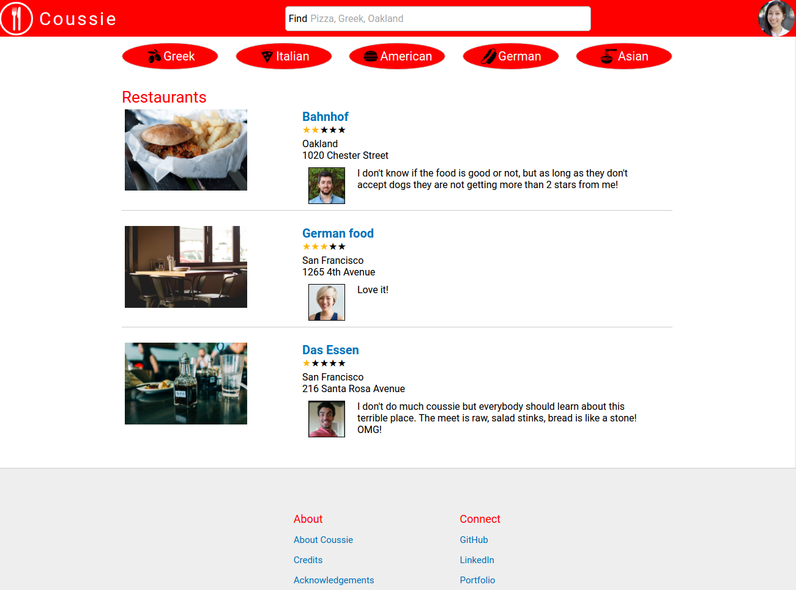
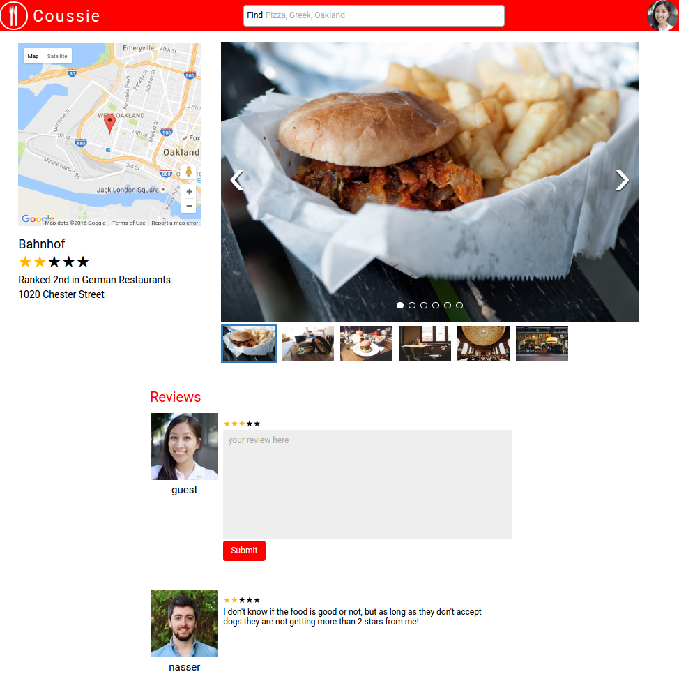

# Coussie

[Coussie live][live]

[live]: http://www.coussie.com

Coussie is a single-page full-stack web application inspired by Yelp. It
is developed on Ruby on Rails backend and React-Redux frontend. Coussie
allows users to find and rate restaurants in the Bay Area.

## Features & Implementation

### Single-Page App

Coussie is a modern single-page app where all the content is delivered
on a single static page. The root page listens to the store configured by
a `RootReducer` (`SessionReducer`, `RestaurantReducer`, and `CategoryReducer`)
and a `RootMiddleware` (`SessionMiddleware`, `RestaurantMiddleware`,
`CategoryMiddleware`). Current user information is stored on the window
as a bootstrapping method and it excludes sensitive information.
Root page renders content depending on the response
from store's `Session.currentUser`. An ajax request to
`API::SessionsController#create` provides the current user information.

```ruby
class Api::SessionsController < ApplicationController
  def create
    @user = User.find_by_credentials(params[:user][:username], params[:user][:password])
    if @user
      login(@user)
      render "api/users/show"
    else
      render json: ["Invalid username/password combination"], status: 401
    end
  end
end
```

api/users/show renders a partial which only extracts insensitive information.

```ruby
json.extract! user, :username, :picture_url;
```

### Rendering Restaurants

Restaurants data is stored in `restaurants` table which has `name`, `city`,
`lat`, `lng`, `category_id`, `owner_id`(for future implementation), `website`,
`telephone`, `price_range`, and `address` columns. The `restaurants` table is joined
with `categories` table(`Category` model has many `restaurants`), `reviews` table
(`Review` model has belongs to associations to `reviewer` (`User`) and
`restaurant`), `users` table (for information regarding reviewers) and `images`
table (which stores image urls of restaurants). These information can be
rendered independent on the presence of a current user.

Restaurant data is rendered using React components named `RestaurantIndex`,
`RestaurantIndexItem`, `RestaurantShow`, and `RestaurantMap`. The image below
shows `RestaurantIndex` and `RestaurantIndexItem` components.



`RestaurantIndex` holds index items which all render single restaurant
information. These information is passed to `RestaurantShow` component upon
click on the restaurant title or the image. `RestaurantShow` contains
`RestaurantMap` together with restaurant details such as images or reviews.



### Reviews

`RestaurantShow` component renders `Review` components ordered by their post
dates (newest first) just after restaurant details. No new fetch requests
are required (except when a new review is posted) since the review information
is taken from the store.

`ReviewForm` component is situated just before the reviews and is only rendered
if there is a current user present. Users are required to log in in order
to post reviews.

### Categories

`CategoryIndex` component renders `CategoryIndexItem`s on the root page over
the `RestaurantIndex`. These index items filter the store's `state.restaurants`
by the restaurant's `category_id`s. This is done via an ajax request to
`API::CategoriesController`.

```ruby
class Api::CategoriesController < ApplicationController
  def index
    @categories = Category.all
    render :index
  end

  def show
    @category = Category.find(params[:id])
    render :show;
  end
end
```

Rendered `show` view filters the restaurants by `category_id` as follows

```ruby
@category.restaurants.each do |restaurant|
  ...
end
```

###Search/Filter

Coussie has a real-time search feature which filters the store's
`state.restaurants` after each change in the search box. It causes a filter
action to be dispatched without any need to press enter or click on a
search icon. The action fires an ajax request to `API::RestaurantsController#index`
which filters the data by the query.

Restaurants can be filtered by name, city, or category. Since the category
titles are stored on a separate table, the results are combined in the
controller as follows.

```ruby
class Api::RestaurantsController < ApplicationController
  def index
    if params[:query]
      condition = "%#{params[:query]}%"
      @restaurants = Restaurant.where("name ILIKE ? OR city ILIKE ?", condition, condition)
      from_categories = []
      Category.where("title ILIKE ?", condition).each do |c|
        from_categories.concat(c.restaurants)
      end.flatten
      @restaurants = @restaurants.concat(from_categories)
    else
      @restaurants = Restaurant.all
    end
    render :index
  end
  ...
end
```

## Future Directions for the Project

I am planning to implement menu features for restaurants which will include
menu items. These menu items will be voted by users which will allow us
choosing e.g. the best cheeseburger in San Francisco instead of just
choosing the best American Restaurant.

Another feature I would like to implement is profile pages for reviewers.
`users` table already includes columns necessary for the feature, however,
the react components are not implemented yet.
